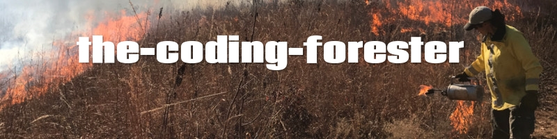

### 👋 Hi I'm Stephanie

I am a trained forester turned software engineer. Previously I managed 2100 acres of diverse land, now I am taking on a whole new kind of diversity filled with completely differnt kinds of trees.

- 🔭 I’m currently working on my capstone project which is a resturant reservation app, but I have several personal projects lined up for the near future

- 🌱 I've been learning JavaScript, React, PostgreSQL and much more. I am especially excited about expanding into TypeScript in the next few months.

- 👯 I’m especially insterest in collaborating on projects that will help improve natural resource management
